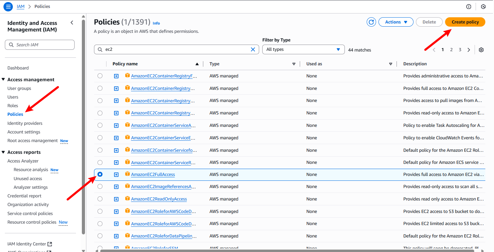
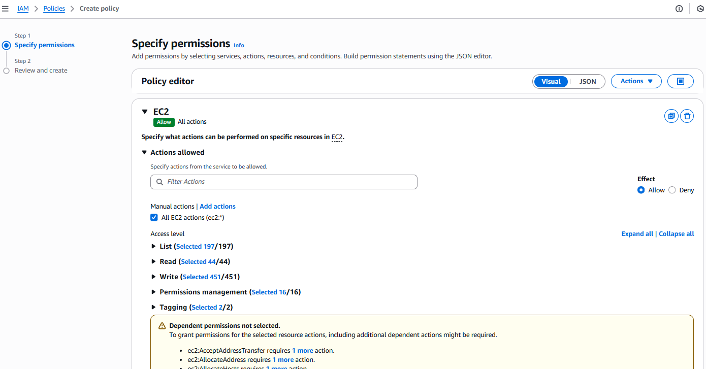

# aws-identity-and-access-management

A deep dive into AWS IAM (Identity and Access Management), focusing on
creating and managing users, groups, and roles. This project
demonstrates how to implement policies to secure AWS resources, ensuring
proper access control and enhancing overall cloud security.

## Granting Access to Users and Entities

### Creating a Policy

We begin by creating a policy granting full access to EC2 instances and
then attaching it to a user named Eric.

1.  Navigate to the AWS Management Console and search for 'IAM'.\
    

2.  On the IAM dashboard, navigate to the left pane and click on
    'Policies'. Use the search bar to type 'ec2' and select
    **AmazonEC2FullAccess** from the list of policies. Then click on
    **Create policy** at the top right corner.\
    

    In the 'Service' dropdown, select **EC2** and check the box for
    **All EC2 actions (ec2\*)**.\
    

    Scroll to the bottom, tick **All** under resources, and click
    **Next**.\
    

    On the Review and Create page, enter a name for the policy
    (`ec2-full-access`) and a description, then click **Create
    policy**.\
    

### Creating User Eric

On the left pane, click **Users**, then click **Create user** at the top
right.\

Enter a user name (`eric`) and check the box for *Provide user access to
the AWS Management Console - optional*.

Select *I want to create an IAM user* and choose **Custom password**.
Enter a password, check *Users must create a new password at next
sign-in - Recommended*, then click **Next**.\

Select **Attach policies directly**, choose the `ec2-full-access` policy
created earlier, then click **Next**.\

Review the details and click **Create user**.\

On the review page, notice the difference between **Customer managed**,
**AWS managed**, and **inline** policies.

The new user `eric` has been created successfully. Save his sign-in
details securely for future use, then click **Return to users list**.\

### Creating User Group

On the left pane, click **User groups** and then click **Create
group**.\

Enter a group name (`Backend-Developers`) and click **Create user
group**.\

### Creating User Jack and Adding Him to the Group

Click **Users**, then **Create user**. Enter `jack` in the user name
field and click **Next**.\

In the 'Permissions options' section, select **Add user to group**,
check the `Backend-Developers` group, and click **Next**.\

Review the details for Jack and click **Create user**.\

### Creating User Ade and Adding Him to the Group

Repeat the process to create a user named `Ade` and add him to the
`Backend-Developers` group.\

### Creating Backend-Developers Policy

Now, create a new policy for the `Backend-Developers` group. Navigate to
**Policies** and click **Create policy**.\

On the 'Specify permissions' page, select **EC2** as the service.\

Click **Add more permissions** and select **S3**. Check **All EC2
actions (ec2\*)** and **All S3 actions (s3\*)**. Select **All** under
resources and click **Next**.\

Enter a name (`backend-developers-policy`) and a description, then click
**Create policy**.\

### Attaching Policy to User Group

From the left pane, click **User groups**, then select the
`Backend-Developers` group.\

Go to the **Permissions** tab, click **Add permissions**, and choose
**Attach policies**.\

Search for the `backend-developers-policy`, select it, and click
**Attach policies**.\

The policy has now been successfully attached to the group, granting
full access to EC2 and S3 for all group members.\

------------------------------------------------------------------------

## Project Reflection

-   **Understanding IAM**: IAM serves as the security foundation for AWS
    resources, controlling access and permissions.\
-   **Security Importance**: IAM ensures data protection, compliance,
    and prevents unauthorized access.\
-   **Policy Creation**: Crafting IAM policies helps regulate resource
    access effectively.\
-   **Practical Application**: Hands-on exercises provided real-world
    experience in setting up IAM users, groups, and policies, enhancing
    confidence in IAM implementation.

------------------------------------------------------------------------

## Conclusion

This project provided a comprehensive, practical understanding of AWS
IAM. By creating users, groups, and custom policies, and attaching them
appropriately, we demonstrated how to establish fine-grained access
control for AWS resources. IAM not only safeguards cloud environments
but also enables scalability and collaboration by ensuring that the
right people and teams have the right level of access. The skills
developed here form a solid foundation for managing security in
real-world AWS deployments.
